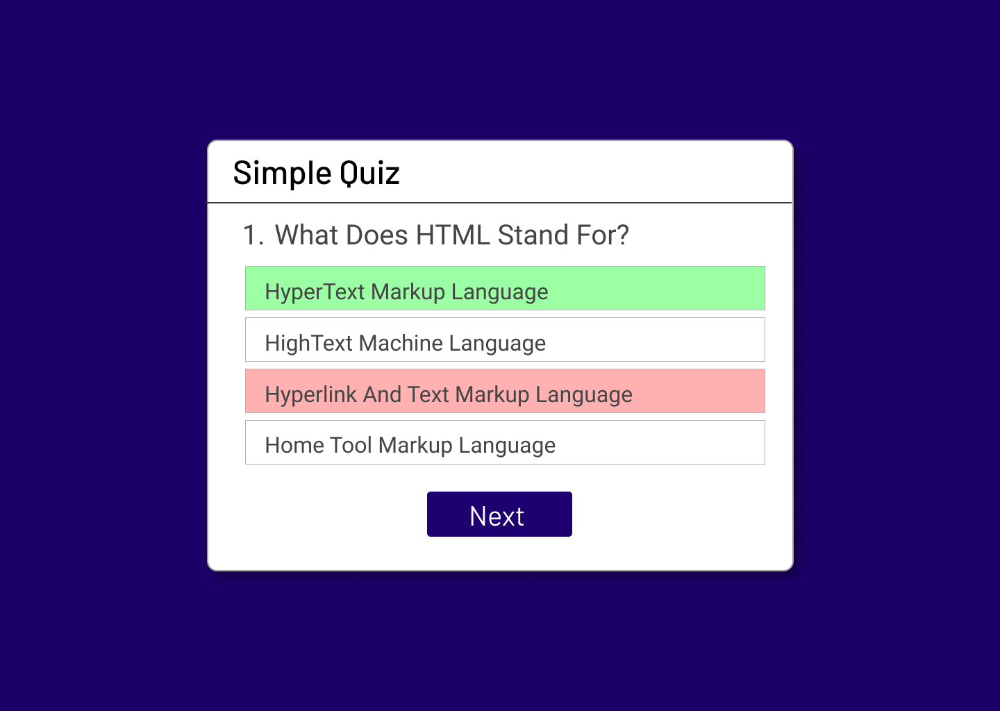

# Quiz App 🧠🎉

## Description
The **Quiz App** is a dynamic, interactive web application that allows users to test their knowledge on various topics. Built with HTML, CSS, and JavaScript, it features a clean and engaging UI designed using Figma. This project showcases responsive design, user-friendly interactions, and a seamless quiz experience.

  
    

  

## Features
- 🎯 **Dynamic Questions**: A variety of questions to keep users engaged.
- 📱 **Responsive Design**: Optimized for both mobile and desktop views.
- 🎨 **Custom UI**: Visually appealing interface crafted with Figma.
- 🕒 **Timer Functionality**: Adds excitement by limiting time for each question.
- 📊 **Score Tracking**: Displays user scores at the end of the quiz.

## Technologies Used
- **Frontend**: HTML, CSS, JavaScript
- **Design**: Figma

## Live Demo  
[**View the Live Project**](https://dark1arrow.github.io/quiz-app/)  

## Figma Design  
[**View Figma Design**](https://www.figma.com/design/rervNKegOt7yXEDeSnH9UC/java-script-project?node-id=58-4&t=6Hrr0Bquue0TtiN2-1)  

## LinkedIn 
[**Check LinkedIn**](https://www.linkedin.com/in/gouatm-khanna-61ba63262/?utm_source=share&utm_campaign=share_via&utm_content=profile&utm_medium=android_app)
  